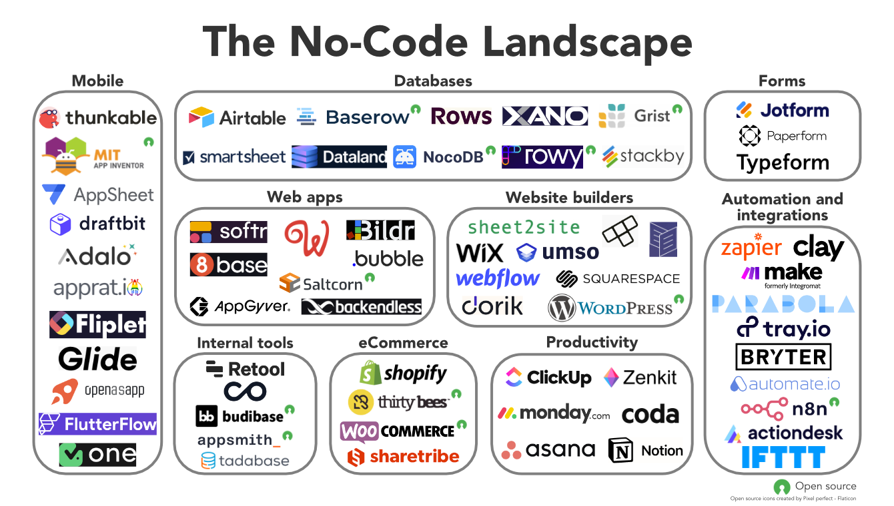
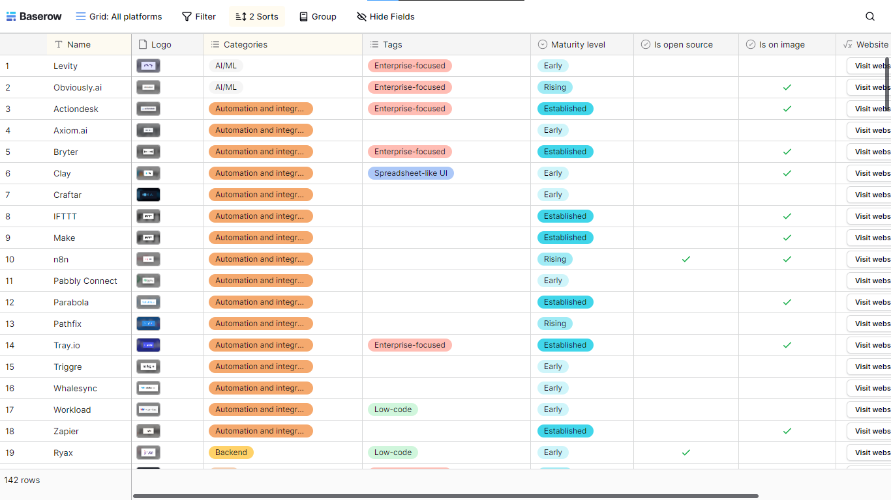
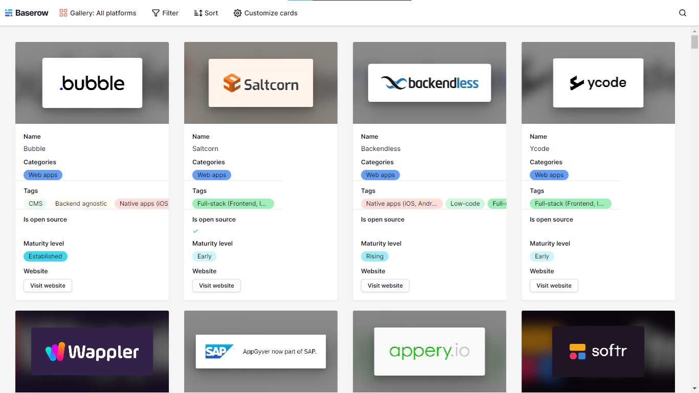
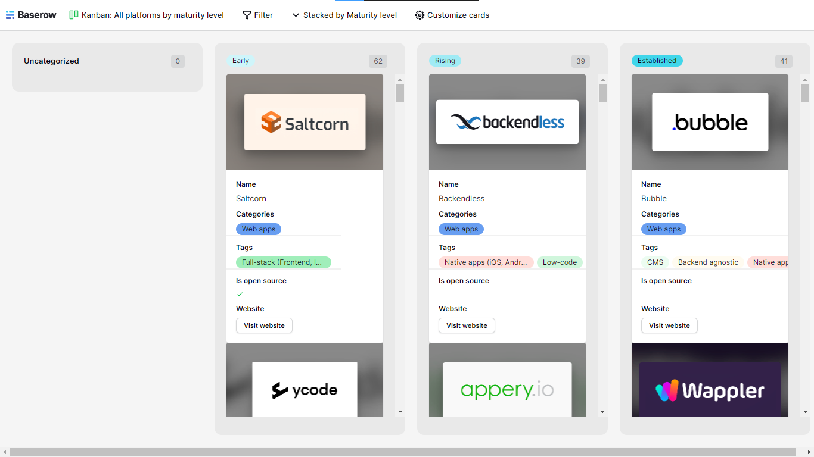

## Hi there 👋


---

**Here are some ideas to get you started:**

🙋‍♀️ A short introduction - what is your organization all about?

---

# The no-code landscape: 100+ platforms to try



```
https://baserow.io/blog/no-code-landscape

```

---

## Grid: All platforms



```

https://baserow.io/public/grid/73WhdMjCOuKC_23f8I0TbEHpv9dhyM7MqCziDTjwBz8
```

---

## Gallery: All platforms



```
https://baserow.io/public/gallery/zjdlTfKOAVEdki8GXuY-6ZwoBkYlNRp_PYmvrwtag3I

```

---

## Kanban: All platforms by maturity level



```
https://baserow.io/public/kanban/_GAqJMhLFuuF5-BGMXe6J27rtS-PS19rU6JKZVyn6uI

```
